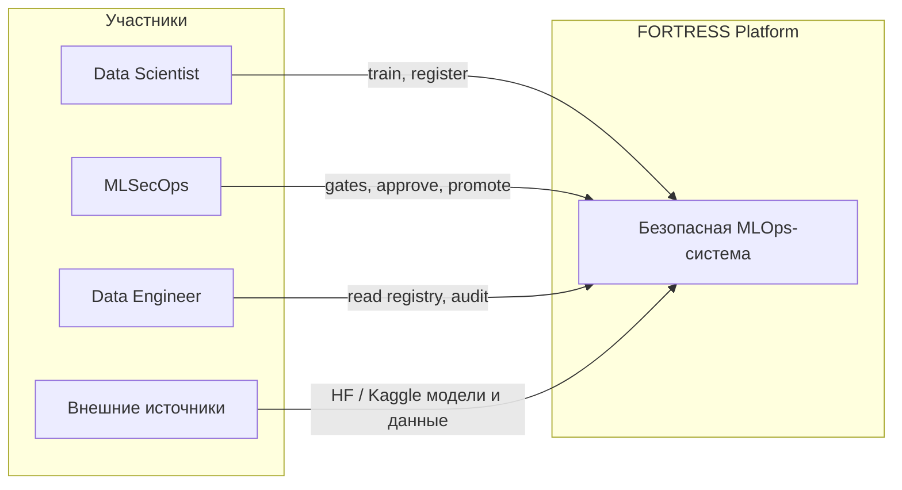
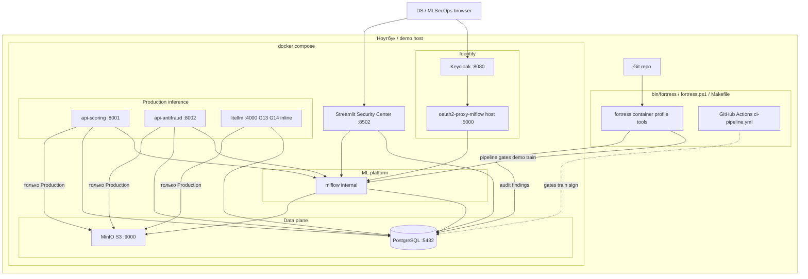
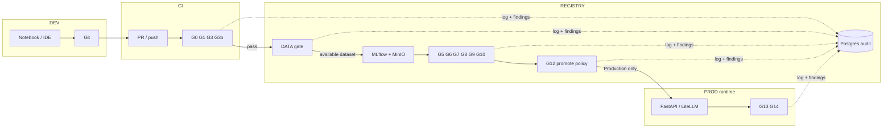
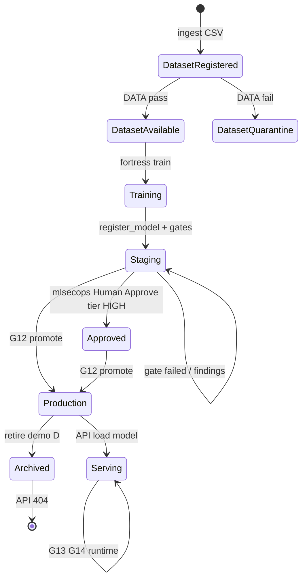
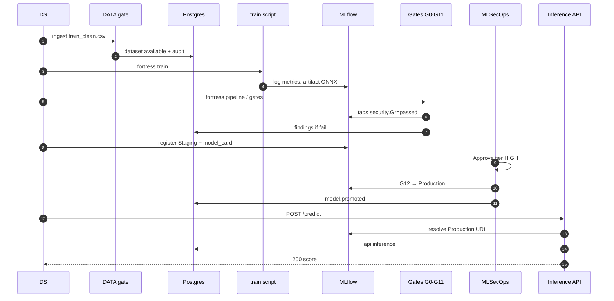
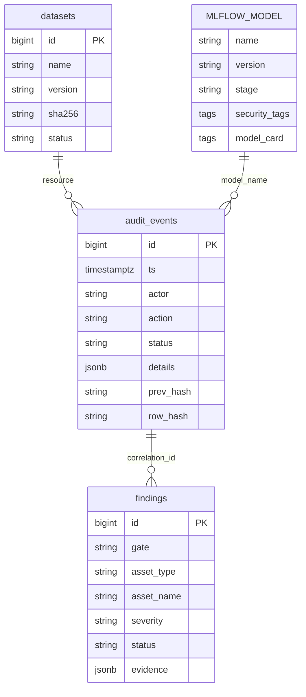
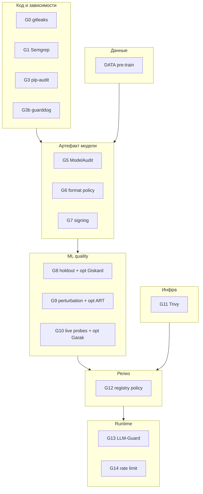
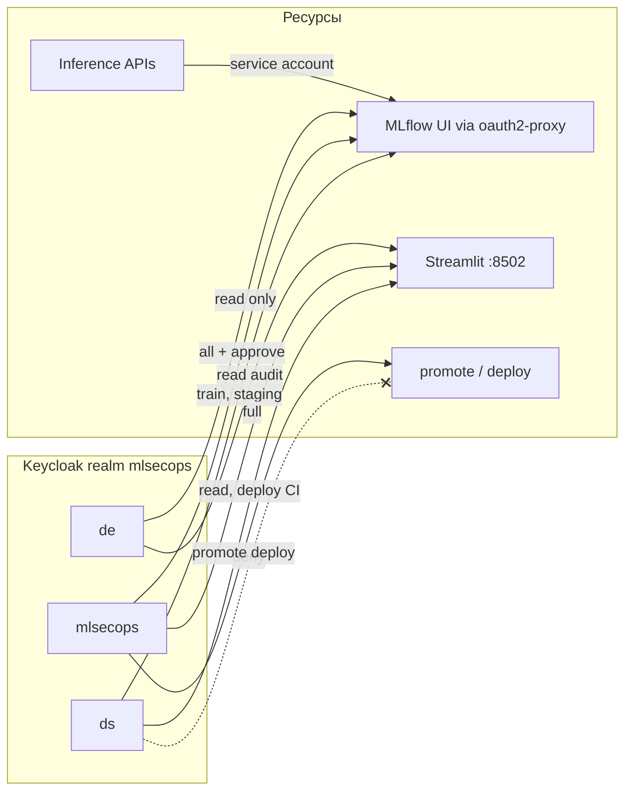
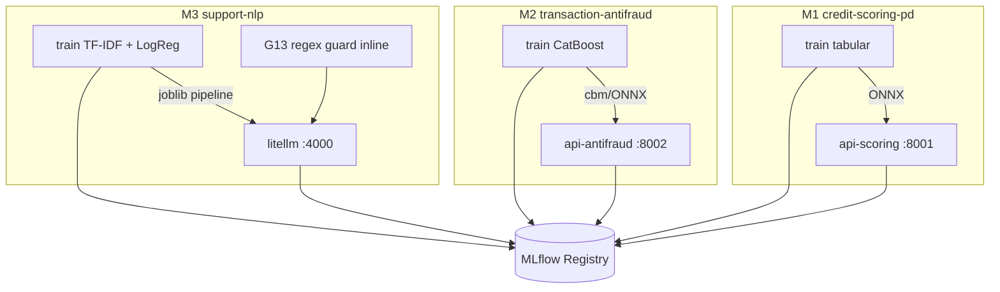
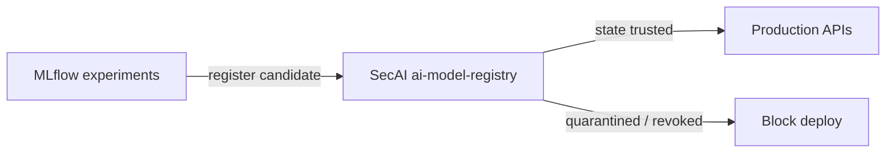

# Архитектура FORTRESS — «Безопасная MLOps-система»

Версия: 1.1 · Профиль: **FORTRESS** (синхронизировано с compose, июнь 2026)  
Связанные документы: [ПЛАН_РЕАЛИЗАЦИИ.md](../ПЛАН_РЕАЛИЗАЦИИ.md), [ТЗ.md](../ТЗ.md)

---

## 1. Контекст (C4 — уровень системы)

**Назначение системы:** автоматизировать ML-жизненный цикл с встроенными Security Gates, реестром моделей, audit trail и RBAC — без ручных чеклистов в Confluence.

---

## 2. Контейнеры (Docker Compose + CI)

| Контейнер | Порт (host) | Роль |
|-----------|-------------|------|
| PostgreSQL | 5432 | `audit_events`, `datasets`, `findings`, `pipeline_runs`, backend MLflow |
| MinIO | 9000/9001 | Артефакты моделей, датасеты |
| Keycloak | 8080 | RBAC: ds, mlsecops, de, product |
| oauth2-proxy-mlflow | 5000 | SSO перед MLflow UI (upstream mlflow:5000) |
| mlflow | — (внутри сети) | Model Registry, stages, теги `security.*` |
| api-scoring | 8001 | M1 inference + G14 |
| api-antifraud | 8002 | M2 inference + G14 |
| litellm | 4000 | M3 intent API + G13 regex + G14 |
| dashboard | 8502 | Streamlit Security Center |
| fortress | — (profile tools) | CLI: train, pipeline, gates, demo, pytest |

---

## 3. Зоны доверия и поток gates

---

## 4. Жизненный цикл модели (states)

| MLflow stage | Условие перехода |
|--------------|------------------|
| `None` / experiment | train завершён |
| `Staging` | register + обязательные gate-теги |
| `Production` | G12 + mlsecops (+ Approve если tier HIGH) |
| `Archived` | вывод из эксплуатации |

---

## 5. Сквозной поток: от датасета до predict

---

## 6. Модель данных (логическая схема)

**Источник правды по версиям:** MLflow.  
**Источник правды по действиям и сработкам:** PostgreSQL.

---

## 7. Security Gates на одной схеме

---

## 8. RBAC (кто к чему подключается)

---

## 9. Три модели в архитектуре

| ID | API | Обязательные gates (кроме общих G0–G7, G11, G12) |
|----|-----|--------------------------------------------------|
| M1 | :8001 | DATA, G8, G9 |
| M2 | :8002 | DATA, G8, G9 |
| M3 | :4000 | G10, G13 runtime |

---

## 10. Фаза 2 (SecAI) — будущее расширение

В MVP **SecAI не используется** — trust boundary = G12 + MLflow stages.

---

*Диаграммы в формате Mermaid — рендерятся в GitHub, GitLab, VS Code/Cursor и на [mermaid.live](https://mermaid.live).*
