# Архитектура FORTRESS — полное руководство

**Версия:** 2.0 (расширенная) · **Профиль:** FORTRESS  
**Связанные документы:** [ПЛАН_РЕАЛИЗАЦИИ.md](../ПЛАН_РЕАЛИЗАЦИИ.md) (v2), [ТЗ.md](../ТЗ.md), [architecture.md](./architecture.md) (краткие схемы)

---

## Для кого этот документ

| Аудитория | Как использовать |
|-----------|------------------|
| **Жюри / защита** | Сквозная картина: зоны доверия, gates, три модели, демо A–E, связь с моделью угроз T1–T10 |
| **Разработчик** | Порты compose, зависимости сервисов, контракты audit/MLflow, когда какой gate запускать |
| **MLSecOps** | Слои защиты, негативные пути, различие Security Center и CEO Report |

Документ **расширяет** [architecture.md](./architecture.md): там — компактные Mermaid-схемы для быстрого обзора; здесь — пояснения на русском, таблицы и «учебниковая» логика решений. Реализация и чеклисты — в [ПЛАН_РЕАЛИЗАЦИИ.md](../ПЛАН_РЕАЛИЗАЦИИ.md); бизнес-контекст и критерии сдачи — в [ТЗ.md](../ТЗ.md).

---

## Глоссарий (краткий)

| Термин | В FORTRESS |
|--------|------------|
| **Gate (G0–G15)** | Автоматическая точка контроля; при fail — блок следующего шага + audit/findings |
| **DATA** | Pre-train gate **датасета** (качество CSV, poisoning); **не** Semgrep G1 |
| **Угроза (T1–T10)** | Сценарий атаки в `docs/threat_model.md`; описывает *что может случиться* |
| **Уязвимость** | Конкретная дыра (CVE, pickle, открытый API без лимита) |
| **Finding** | Запись в Postgres: *что нашёл* сканер (для triage и FP) |
| **Audit event** | Запись в Postgres: *кто* сделал *что*, с hash-chain |
| **MLflow** | Источник правды: версии моделей, stages, артефакты в MinIO, теги `security.*` |
| **Postgres** | Источник правды: журнал действий, реестр датасетов, findings |
| **Stage** | `None` → `Staging` → `Production` → `Archived` (MLflow Model Registry) |
| **HITL** | Ручной Approve mlsecops для `tier=HIGH` перед Production |
| **FORTRESS** | Имя профиля стека в репозитории (не отдельный продукт) |

---

## 1. Контекст системы (C4 — Level 1)

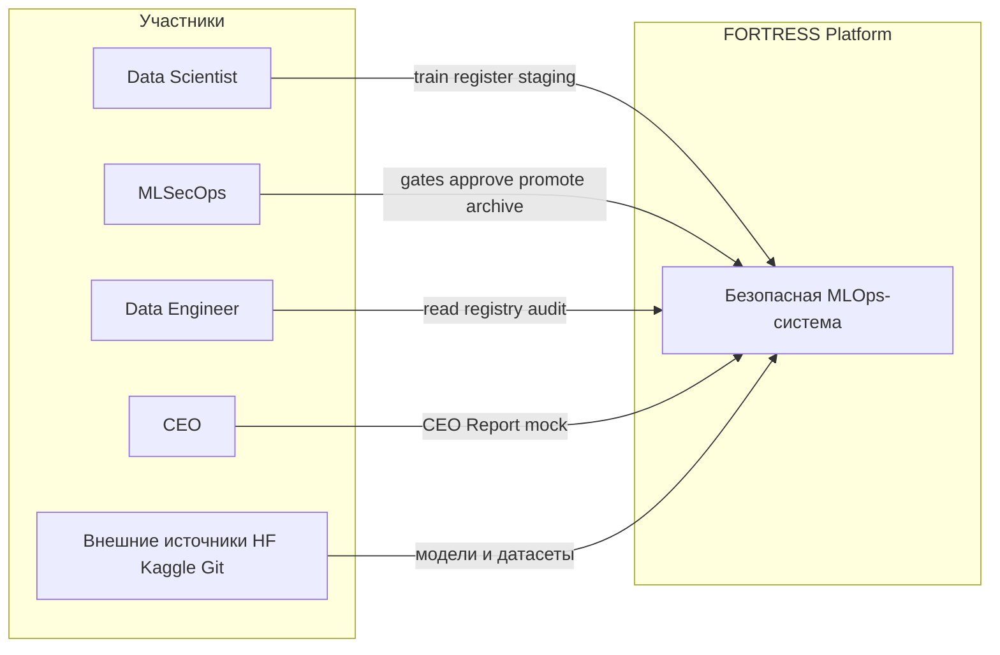

**Пояснение.** Система закрывает требования [ТЗ.md](../ТЗ.md): автоматизированный ML-жизненный цикл с встроенными Security Gates, реестром моделей, audit trail и RBAC — без ручных чеклистов в Confluence. DS отвечает за обучение и регистрацию в Staging; MLSecOps — за прохождение gates, HITL и promote в Production; DE — за наблюдаемость и аудит; CEO видит отдельный мок-отчёт (см. §9). Внешние источники — типичный вектор supply chain (сценарий демо A).

---

## 2. Контейнеры и развёртывание (Docker Compose)

Состояние **фактического** `docker-compose.yml` в репозитории (июнь 2026). Сервисы `oauth2-proxy` и отдельный sidecar LLM-Guard указаны в плане §8 как следующий шаг интеграции с Keycloak; G13 для M3 в MVP может быть встроен в `litellm` (`LLM_GUARD_ENABLED`).

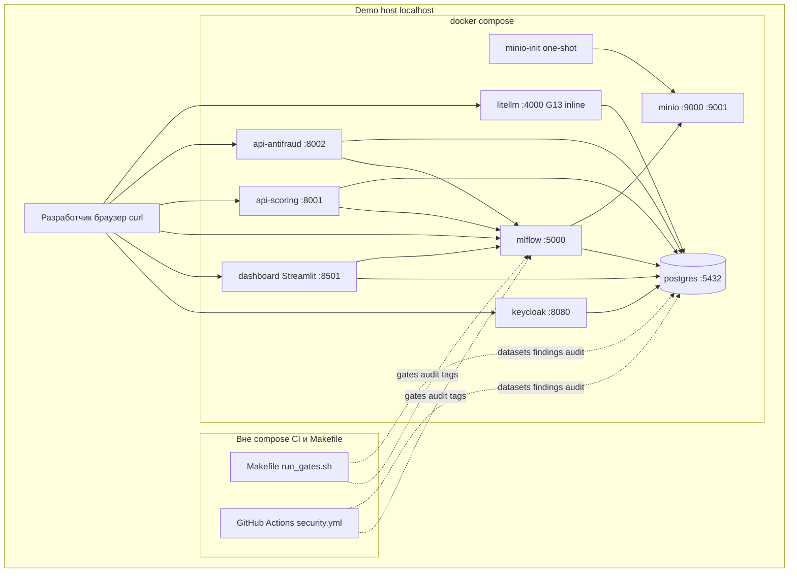

**Пояснение.** Один `docker compose up -d` поднимает data plane (Postgres + MinIO), identity (Keycloak), ML platform (MLflow), три inference-контура (M1/M2 FastAPI, M3 LiteLLM) и Streamlit Security Center. Gates **не** являются долгоживущими контейнерами: это CLI на хосте/в CI, результаты пишутся в Postgres и теги MLflow. `minio-init` создаёт бакеты `mlflow` и `datasets` после healthcheck MinIO.

### Таблица сервисов

| Сервис | Порт (host) | Образ / сборка | Зависимости | Назначение |
|--------|-------------|----------------|-------------|------------|
| `postgres` | 5432 | `postgres:16-alpine` | — | Backend MLflow, Keycloak, `audit_events`, `datasets`, `findings` |
| `minio` | 9000, 9001 | `minio/minio:latest` | — | S3-совместимое хранилище артефактов |
| `minio-init` | — | `minio/mc:latest` | `minio` (healthy) | One-shot: бакеты `mlflow`, `datasets` |
| `keycloak` | 8080 | `quay.io/keycloak/keycloak:24.0` | `postgres` | RBAC: ds, mlsecops, de, product, ceo |
| `mlflow` | 5000 | `infra/docker/Dockerfile.mlflow` | `postgres`, `minio`, `minio-init` | Model Registry, experiments, теги `security.*` |
| `api-scoring` | 8001 | `services/api_scoring/Dockerfile` | `mlflow`, `postgres` | M1 `credit-scoring-pd`, G14 |
| `api-antifraud` | 8002 | `services/api_antifraud/Dockerfile` | `mlflow`, `postgres` | M2 `transaction-antifraud`, G14 |
| `litellm` | 4000 | `services/litellm/Dockerfile` | `postgres` | M3 `support-nlp`, G13 + G14 |
| `dashboard` | 8501 | `dashboard/Dockerfile` | `postgres`, `mlflow` | Security Center, CEO mock |
| `oauth2-proxy` *(план §8)* | 4180 | образ из плана | `keycloak`, `mlflow` | SSO перед MLflow UI — **не в текущем compose** |

**URL для демо:** Streamlit `http://localhost:8501`, MLflow `http://localhost:5000`, Keycloak `http://localhost:8080`, M1 `http://localhost:8001/docs`, M2 `http://localhost:8002/docs`, M3 `http://localhost:4000`.

---

## 3. Зоны доверия (DEV → CI → REGISTRY → PROD)

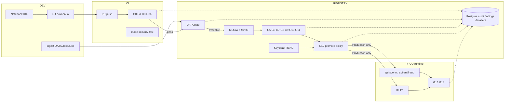

**Пояснение.** Доверие **нарастает** по мере продвижения артефакта: в DEV допустимы эксперименты, в CI — жёсткая проверка кода и зависимостей, в REGISTRY — скан модели, подпись, валидация ML-качества и meta-gate G12, в PROD — только модели со stage `Production` и пройденным security-профилем. Любой fail фиксируется в Postgres; переход stage в Production без зелёных тегов и роли mlsecops блокируется G12 и RBAC.

---

## 4. Security Gates — слоистый пайплайн

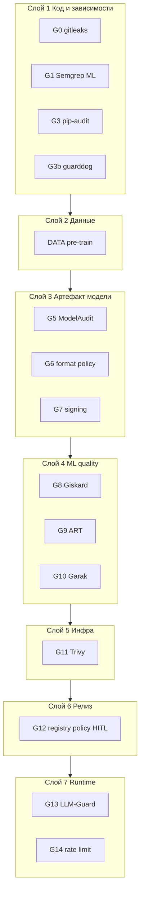

**Пояснение.** Gates организованы **defense in depth**: одна угроза часто закрывается несколькими контролями (pickle: G1 + G5 + G6 + G7), один gate закрывает несколько рисков (G3 — CVE в deps). G12 — не сканер, а **сводная политика** реестра. DATA вынесен отдельно, потому что объект проверки — CSV/датасет, а не исходный код (см. §6).

### Таблица gates (обязательные MVP)

| ID | Инструмент | Этап ЖЦ | Что блокирует при fail |
|----|------------|---------|-------------------------|
| **G0** | gitleaks | Dev / CI | Commit/PR с секретами; дальнейший pipeline |
| **G1** | Semgrep (Trail of Bits ML) | CI | PR с опасными паттернами (`pickle.load`, и т.д.) |
| **G3** | pip-audit | CI | Зависимости с CVE ≥ high |
| **G3b** | guarddog | CI | Typosquat / malicious PyPI metadata |
| **DATA** | `data_gate.py` | Pre-train | `make train-*`, ingest в quarantine |
| **G5** | ModelAudit | Pre-register | `register_model`, запись в MLflow |
| **G6** | `check_format_policy.py` | Pre-register | `.pkl` и небезопасные форматы в prod bundle |
| **G7** | model-signing (Sigstore) | Pre-register / deploy | Register/promote без валидной подписи |
| **G8** | Giskard | Validation | Promote табличных M1/M2 |
| **G9** | ART | Validation | Promote M1/M2 (adversarial robustness) |
| **G10** | Garak | Validation | Promote M3 |
| **G11** | Trivy | Build | Deploy образа с CRITICAL CVE |
| **G12** | `promote_to_production.py` | Release | Transition в **Production** |
| **G13** | LLM-Guard | Runtime M3 | Запросы с jailbreak/PII → 403 + audit |
| **G14** | FastAPI middleware | Runtime все API | Burst > N req/min → 429 + audit |

**Опционально (фаза усиления):** G2 bandit, G4 Ceres, G4b MEDUSA, G5b Fickling, G15 Alibi Detect (drift).

### Mapping угроз T1–T10 → gates

| Угроза | Суть | Gates / практика |
|--------|------|------------------|
| **T1** | Pickle RCE в артефакте | G1, G5, G6, G7 |
| **T2** | Typosquat PyPI | G3b |
| **T3** | Секрет в Git/ноутбуке | G0 |
| **T4** | CVE в deps / образе | G3, G11 |
| **T5** | Model extraction через API | G14 |
| **T6** | Prompt injection (LLM) | G10, G13 |
| **T7** | Подмена модели в registry | G7, G12, hash-chain audit |
| **T8** | Несанкционированный promote | RBAC Keycloak, G12, HITL |
| **T9** | Data poisoning | **DATA** |
| **T10** | Adversarial evasion (tabular) | G9 (+ мониторинг G15 backlog) |

---

## 5. Жизненный цикл модели (state machine)

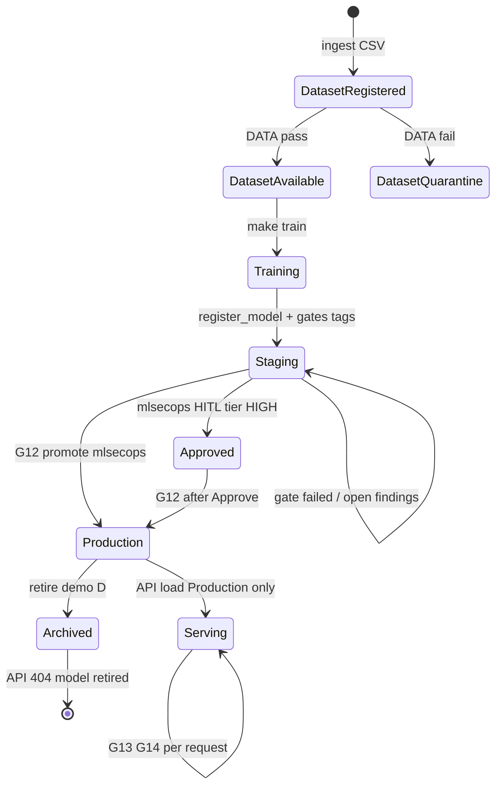

**Пояснение.** Жизненный цикл связывает **датасет** (Postgres `datasets`), **модель** (MLflow stages) и **сервинг** (FastAPI/LiteLLM). Quarantine датасета не даёт начать train на отравленных данных (демо: `train_poisoned.csv`). Staging — буфер с полным security-профилем; Production — только после G12 и (для HIGH) `security.approved_by`. Archived снимает модель с inference (сценарий D).

| MLflow stage | Условие перехода |
|--------------|------------------|
| Experiment / `None` | Train завершён, run в MLflow |
| `Staging` | `register_model` + обязательные gate-теги + model_card |
| `Production` | G12 + роль mlsecops + Approve если tier HIGH |
| `Archived` | `model.archived`, API не отдаёт модель |

---

## 6. Сквозные последовательности: happy path и негативные пути

### 6.1. Happy path (сценарий B)

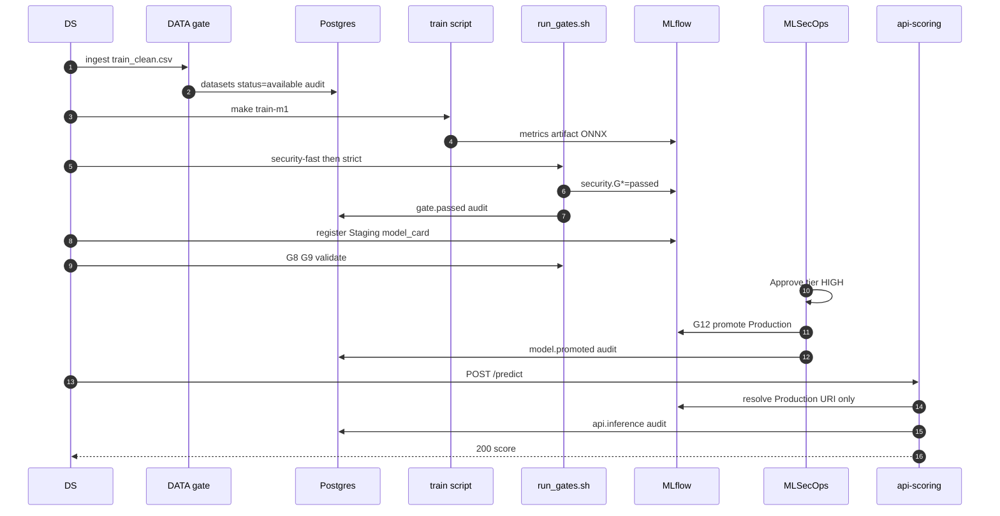

### 6.2. Негатив: отравленные данные (T9)

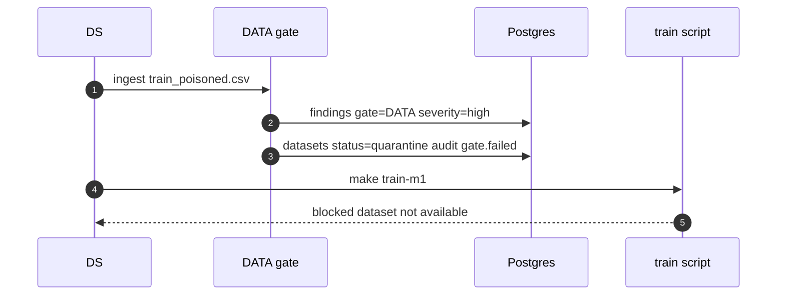

**Пояснение.** DATA проверяет **содержимое и схему** CSV до обучения. G1 Semgrep сканирует **исходный код** репозитория — другой объект, другой этап, другие правила. Путаница G1 vs DATA — частый вопрос жюри (см. §6.3).

### 6.3. Негатив: evil pickle (T1, сценарий A)

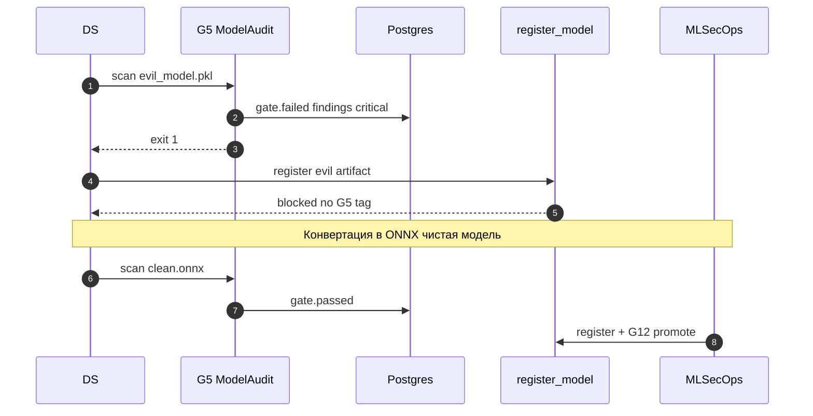

---

## 7. Модель данных (ER): audit, datasets, findings, MLflow

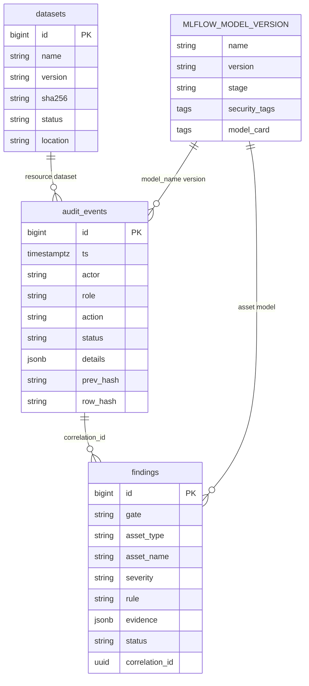

**Пояснение.** MLflow хранит версии, stages и бинарные артефакты в MinIO; Postgres — **операционную память** платформы: кто продвинул модель, какие gates упали, какие датасеты в quarantine. Findings дублируют сработки для UI triage; бизнес-решение «можно ли в Production» читается из тегов MLflow скриптом G12, а не из ручного UPDATE findings.

---

## 8. RBAC и поток решений

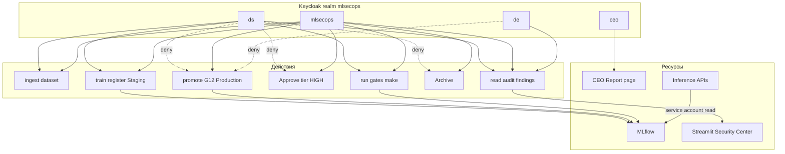

**Пояснение.** RBAC разделяет **создание** артефакта (ds) и **доверие** к релизу (mlsecops). Promote и Approve недоступны ds — демонстрируется на защите логином ds → 403/CLI error. Inference-сервисы используют service account только на чтение Production из MLflow.

---

## 9. Топология трёх моделей (M1 / M2 / M3)

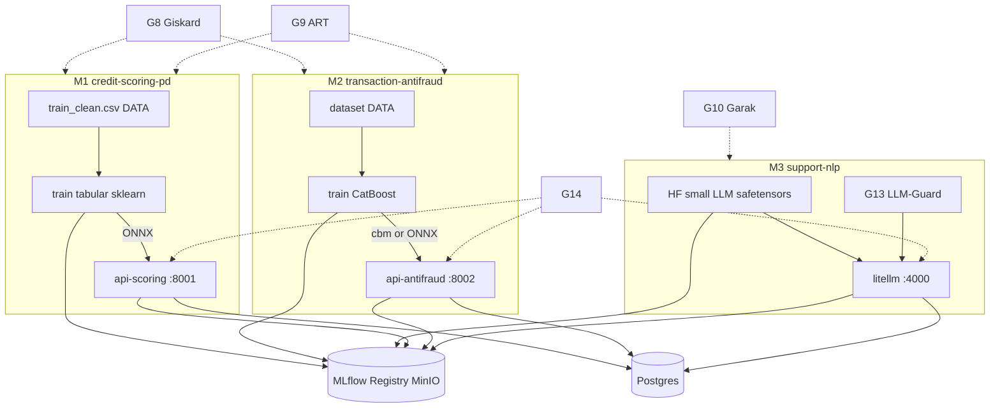

| ID | Registry name | API | Формат prod | Обязательные gates сверх общих |
|----|---------------|-----|-------------|--------------------------------|
| **M1** | `credit-scoring-pd` | :8001 | ONNX | DATA, G8, G9 |
| **M2** | `transaction-antifraud` | :8002 | CBM / ONNX | DATA, G8, G9 |
| **M3** | `support-nlp` | :4000 | safetensors + LiteLLM | G10, G13 runtime |

**Пояснение.** ТЗ требует ≥3 разных ML-решения: два табличных (классический ML) и один NLP/LLM для runtime-защиты. M3 не обязан проходить G9; M1/M2 не используют G10/G13 в offline-фазе, но все API покрыты G14.

---

## 10. CI/CD и GitHub Actions

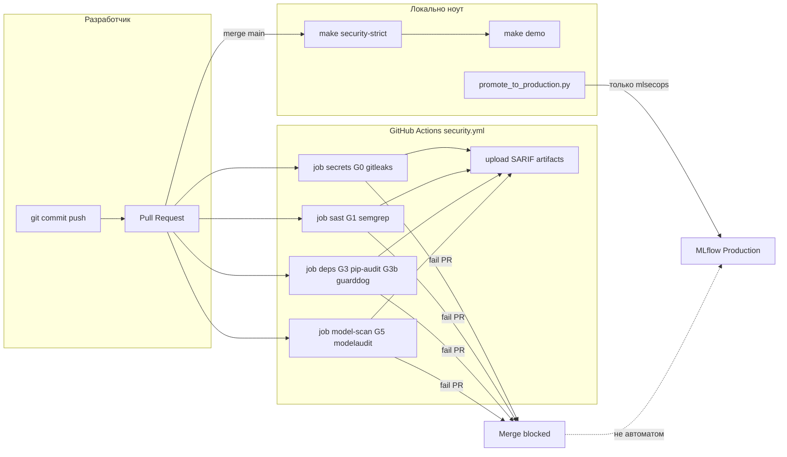

**Пояснение.** CI **не** переводит модель в Production: deploy job отсутствует намеренно. GitHub Actions дублирует ранние gates (G0, G1, G3, G3b, G5 на артефактах в репо). Полный strict-профиль, DATA, G8–G12, promote — на демо-хосте через Makefile/`demo.sh`, чтобы жюри видело audit в локальном Postgres. Это согласовано с §13 [ПЛАН_РЕАЛИЗАЦИИ.md](../ПЛАН_РЕАЛИЗАЦИИ.md).

---

## 11. Runtime: G13 и G14 на inference

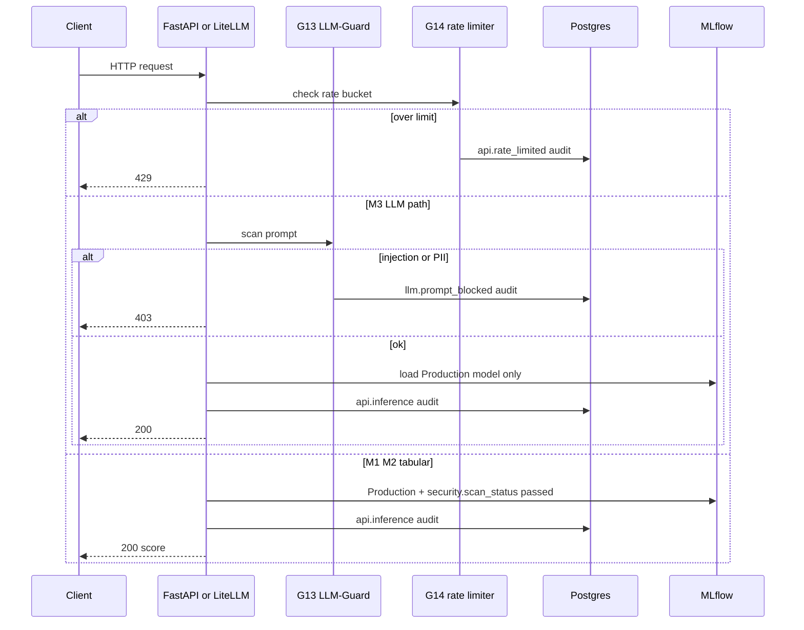

**Пояснение.** Runtime-контроли — последний рубеж: даже при ошибке процесса release злоумышленник упирается в rate limit (T5) и блок prompt (T6). Inference **никогда** не подгружает Staging и локальные pickle из git — только URI Production с зелёным security-профилем (default-deny, §12).

---

## 12. Фаза 2: SecAI (будущее, пунктир)

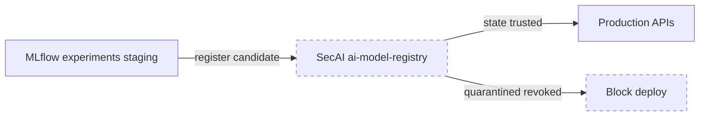

**Пояснение.** В MVP trust boundary = G12 + MLflow stages + RBAC. SecAI ([ai-model-registry](https://github.com/SecAI-Hub/ai-model-registry)) планируется после стабильного `demo.sh`: состояния `acquired` → `quarantined` → `trusted` → `revoked`; G12 потребует `trusted` перед Production. См. §16 плана.

---

## 13. Пояснительные разделы (почему так устроено)

### 13.1. Почему два источника правды (MLflow и Postgres)

MLflow оптимизирован под **версионирование моделей и артефакты**: какая версия в Production, какие метрики, где лежит ONNX в S3. Postgres оптимизирован под **операционный аудит и расследования**: кто нажал promote, цепочка hash для демо неизменности, реестр датасетов с quarantine, findings с triage. Дублировать в Postgres «можно ли в prod» как единственный флаг — ошибка: G12 читает теги MLflow, а Postgres получает **след действия**. UI Security Center агрегирует оба API (см. §12.3 плана).

### 13.2. Почему DATA ≠ G1

| | **DATA** | **G1 Semgrep** |
|---|----------|----------------|
| Объект | CSV / датасет | Python, notebooks, ML-код |
| Этап | Pre-train, ingest | CI на каждый PR |
| Угрозы | T9 poisoning, плохие данные | T1 небезопасный код, часть supply chain |
| Результат | `datasets.status`, quarantine | SARIF по репозиторию |

Смешение терминов ломает демо: `train_poisoned.csv` должен падать на **DATA**, а не на Semgrep.

### 13.3. Default-deny Production

Inference-сервисы (`api-scoring`, `api-antifraud`, `litellm`) резолвят модель только при `stage=Production` и `security.scan_status=passed` (и наличии обязательных тегов, проверенных на этапе G12). Staging, локальные пути `./models/...` без promote, «временный pickle» — **запрещены** для ответа клиенту. Это закрывает T7/T8: даже при компромиссе UI без mlsecops модель не попадёт в ответ API.

### 13.4. CEO Report vs Security Center

| | **CEO Report** | **Security Center** |
|---|----------------|---------------------|
| Аудитория | CEO (мок из ТЗ) | MLSecOps, ds, de |
| Данные | Захардкожено «всё супер» | Postgres + MLflow, реальные findings |
| Цель | Юмор/отсылка к ТЗ | Операционная видимость и демо |

На защите показывают **оба**: контраст подчёркивает, что безопасность — не декоративная страница, а отдельный operational UI.

---

## 14. Демо-сценарии A–E

Запуск: `make demo` после `docker compose up -d` и `make bootstrap` (контракт §11 плана).

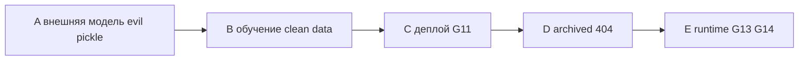

| Сценарий | Суть | Ключевые шаги | Gates / артефакты |
|----------|------|---------------|-------------------|
| **A** | Внешняя модель: негатив → позитив | evil_model.pkl → fail G5 → ONNX → register → promote → curl :8001 | G5, G6, G7, G12 |
| **B** | Своя модель на чистых данных | ingest clean → train → G8/G9 → register → Approve → promote | DATA, G8, G9, G12 |
| **B−** | Мини-негатив 30 с | `train_poisoned.csv` → DATA fail → quarantine | DATA |
| **C** | Деплой | `docker compose build api-scoring` → G11 → Production → predict 200 | G11, G12 |
| **D** | Вывод из эксплуатации | stage Archived → API 404 → `model.archived` | G12 policy |
| **E** | Runtime бонус | jailbreak → M3 403; burst → M1 429 | G13, G14 |

**Фраза для жюри (A):** «Supply chain остановлен на регистрации; в prod ушла только подписанная ONNX».

---

## 15. Связь с другими документами

| Документ | Содержание |
|----------|------------|
| [docs/architecture.md](./architecture.md) | 10 компактных Mermaid-схем без длинных пояснений |
| [ПЛАН_РЕАЛИЗАЦИИ.md](../ПЛАН_РЕАЛИЗАЦИИ.md) | Gates §5, compose §8, demo §11, CI §13, SecAI §16 |
| [ТЗ.md](../ТЗ.md) | Критерии сдачи, роли, демо, запрет RCE в prod-коде |
| [docs/threat_model.md](./threat_model.md) | Полная модель угроз T1–T10 |

---

## Приложение: список диаграмм в этом файле

1. C4 Context (§1)  
2. Docker Compose deployment (§2)  
3. Trust zones DEV→CI→REGISTRY→PROD (§3)  
4. Security gates layered pipeline (§4)  
5. Model lifecycle state machine (§5)  
6. Sequence happy path (§6.1)  
7. Sequence DATA poisoning negative (§6.2)  
8. Sequence evil pickle negative (§6.3)  
9. ER audit / datasets / findings / MLflow (§7)  
10. RBAC flow (§8)  
11. M1/M2/M3 topology (§9)  
12. CI/CD GitHub Actions (§10)  
13. Runtime G13/G14 sequence (§11)  
14. SecAI phase 2 dashed (§12)  
15. Demo scenarios A–E flow (§14)  

*Диаграммы Mermaid рендерятся на GitHub, GitLab, VS Code/Cursor и на [mermaid.live](https://mermaid.live).*
