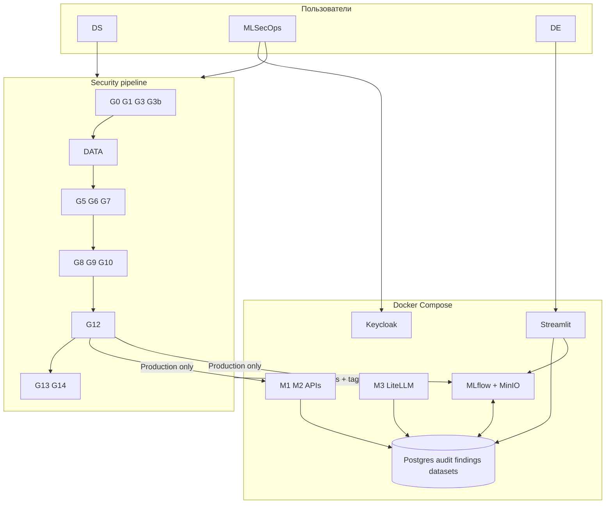
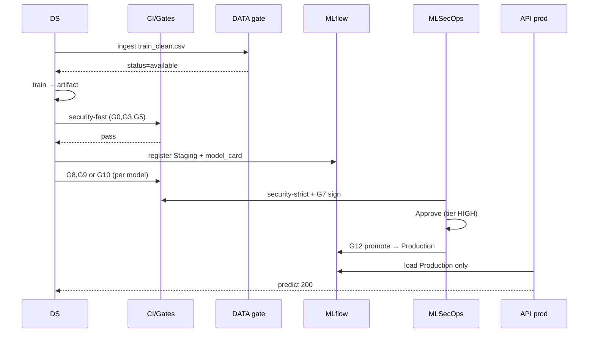

# План реализации кейса «Безопасная MLOps-система»

Профиль: **FORTRESS** (сильный MLSecOps-кейс на open source).  
Стек: **MLflow + Keycloak + Security Gates G0–G15 + DATA + 3 модели + Audit + Streamlit**.  
**Версия плана: 2.0** — полная расшифровка без «дыр в понимании».  
Исключено из MVP: Kubeflow, SecAI ai-model-registry (фаза 2 — §16).

Куратор: Никита Барсуков — [@lainisourgod](https://t.me/lainisourgod)  
Исходное ТЗ: [ТЗ.md](./ТЗ.md)  
Обзор OSS: [open_source_решения](./open_source_решения)

### Как читать этот документ

| Если вопрос… | Смотри раздел |
|--------------|---------------|
| Архитектурные схемы (все) | [docs/architecture.md](./docs/architecture.md) |
| Архитектура — полное руководство (учебник) | [docs/architecture_full.md](./docs/architecture_full.md) |
| Что вообще сдаём и как доказать? | §1, §17 |
| Gate — это уязвимость? | §0, §5.0 |
| Какой gate когда запускать? | §5.5, §5.6, §22 |
| Что такое MLflow vs Postgres? | §2.5 |
| Как выглядит путь модели от Git до API? | §2.6, §11 |
| Что писать в model_card / threat_model? | §4.4, §10 |
| Что делать в день 1–7? | §14 |
| Типичные путаницы (G1 vs DATA, CEO page…) | §20 FAQ |

---

## 0. Глоссарий (единые термины)

| Термин | Определение в нашем проекте |
|--------|---------------------------|
| **MLOps** | Автоматизация train → register → deploy → monitor |
| **MLSecOps** | Безопасность *внутри* того же пайплайна: gates, audit, RBAC, МУ |
| **Gate (G0–G15)** | Автоматическая проверка + **блок** следующего шага при fail |
| **DATA** | Pre-train проверка **датасета** (не путать с **G1 Semgrep**) |
| **Угроза (T1…)** | Сценарий «что может случиться» (для `docs/threat_model.md`) |
| **Уязвимость** | Конкретная дыра (CVE, pickle, открытый API без лимита) |
| **Finding** | Запись в БД: *что* нашёл сканер (для разбора и FP) |
| **Audit event** | Запись в журнале: *кто* сделал *что* и с каким результатом |
| **Model card** | Паспорт модели: владелец, назначение, tier, ограничения |
| **Tier** | Критичность: `LOW` / `MED` / `HIGH` (default **HIGH** → нужен Approve) |
| **Profile security** | Набор тегов MLflow `security.*` после прохождения gates |
| **Stage (MLflow)** | `None` → `Staging` → `Production` → `Archived` |
| **HITL** | Ручное подтверждение mlsecops перед Production для tier HIGH |
| **FORTRESS** | Имя профиля стека в этом репозитории (не отдельный продукт) |

---

## 1. Цель и критерии приёмки

### 1.1. Что строим

Единая платформа, где безопасность — **автоматическая часть пайплайна**, а не чеклист в Confluence:

- реестр моделей с **профилем безопасности**;
- **CI/CD с Security Gates** (блокируют продвижение при риске);
- **≥3 ML-решения** в обучении и эксплуатации;
- **полный жизненный цикл**: внешняя модель → обучение → деплой → **вывод из эксплуатации**;
- **audit trail** всех значимых действий;
- **веб-дашборд** для MLSecOps и ролей;
- **модель угроз** как отдельный документ.

### 1.2. Критерии «сдано» (чеклист для себя и жюри)

| # | Требование ТЗ | Как доказываем |
|---|---------------|----------------|
| 1 | Модель угроз | Файл `docs/threat_model.md` — активы, угрозы, последствия, митигации, приоритеты |
| 2 | ≥3 модели | M1 PD, M2 Antifraud, M3 NLP/LLM — зарегистрированы в MLflow, есть API |
| 3 | Реестр + профиль безопасности | MLflow Model Registry + теги/метаданные + экран в Streamlit |
| 4 | Security Gates | `fortress pipeline` / `fortress gates` / CI — падает на bad artifacts; отчёты в `artifacts/` |
| 5 | Жизненный цикл | `fortress demo` — сценарии A–E без ручной магии |
| 6 | История событий | Таблица `audit_events` + лента в UI |
| 7 | Роли | Keycloak: ds, mlsecops, de (+ опц. product, ceo) |
| 8 | UI | Streamlit Security Center |
| 9 | docker compose | `./bin/fortress all` или `make all` |
| 10 | Runtime (бонус) | LLM-Guard + rate limit на API |
| 11 | Без RCE-закладок | Только **демо-фикстуры** в `tests/fixtures/malicious/` |

### 1.3. Соответствие формулировкам ТЗ (построчно)

| Формулировка в [ТЗ.md](./ТЗ.md) | Где в решении | Как показать на защите |
|---------------------------------|---------------|------------------------|
| Модель угроз | `docs/threat_model.md` | Распечатка / экран: активы, T1–T8+, митигации = gates |
| ≥3 ML-решения | M1, M2, M3 (§4) | MLflow UI: 3 registered models + 3 API |
| Реестр + профиль безопасности | MLflow tags + Streamlit | Вкладка Model detail: `security.*` |
| CI/CD Security Gates | `fortress pipeline`, `ci-pipeline.yml` §13 | Live: `evil_model.pkl` → exit 1 |
| Полный ЖЦ ИИ | §10.3, сценарии A–D | demo: import → train → prod → archived |
| История событий | `audit_events` + hash-chain | Audit log + Verify chain |
| Роли DS / MLSecOps / DE | Keycloak §6 | Логин ds → promote forbidden |
| UI | Streamlit §12 | Security Center (:8502) |
| docker compose + лёгкое демо | §8, `fortress all` | С нуля на ноуте ≤15 мин |
| Runtime (доп.) | G13, G14 | Jailbreak + rate limit live |
| **Нет RCE в prod-коде** | только `tests/fixtures/malicious/` | `grep -r pickle.loads` в services — пусто |

### 1.4. Что НЕ входит в MVP (чтобы не ждать от плана лишнего)

- Полный OPA/Rego policy engine, Dependency-Track, Kubeflow pipelines.
- SecAI registry (фаза 2).
- 100% покрытие OWASP ML Top 10 — в МУ честно пишем backlog.
- Агентские multi-tool системы — опционально; достаточно M3 как LLM API.

---

## 2. Архитектура FORTRESS

**Полный комплект схем (10 диаграмм):** [docs/architecture.md](./docs/architecture.md)  
— контекст, Docker Compose, trust zones, lifecycle, sequence, ER, gates, RBAC, 3 модели.  
**Расширенное руководство (15+ диаграмм, таблицы, пояснения):** [docs/architecture_full.md](./docs/architecture_full.md).

### 2.1. Обзорная схема (логическая)



**Поток в одну строку:** Git/CI → DATA → train → gates → MLflow Staging → Approve → G12 Production → API + runtime G13/G14; все шаги → Postgres audit.

### 2.2. Принципы

1. **MLflow** — источник правды по версиям и stages (`None` → `Staging` → `Production` → `Archived`).
2. **Gates** — внешние CLI; результат пишется в audit + теги модели; без green — нет transition в `Production`.
3. **Default-deny в prod**: inference-сервисы грузят только модели со stage `Production` и `security_status=passed`.
4. **Один compose** — всё для демо локально; CI может дублировать gates через GitHub Actions или `make`.

### 2.3. Что не используем в MVP

| Исключено | Причина |
|-----------|---------|
| Kubeflow / KServe | K8s, не ноут + compose |
| SecAI ai-model-registry | Фаза 2 (после готового MVP) |
| OpenMetadata / lakeFS | Тяжёлые, мало пользы за время |
| MEDUSA, OPA, Dependency-Track | Опционально после MVP |

### 2.4. Зоны доверия (trust zones)

```text
┌─────────────┐     ┌─────────────┐     ┌──────────────────┐     ┌─────────────┐
│  DEV        │     │  CI         │     │  REGISTRY        │     │  PROD       │
│  ноут, git  │────▶│  GitHub/    │────▶│  MLflow+MinIO    │────▶│  FastAPI    │
│  notebooks  │     │  make gates │     │  Postgres audit  │     │  LiteLLM    │
└─────────────┘     └─────────────┘     └──────────────────┘     └─────────────┘
     G0,G1,G3          те же + артефакты      G5–G12, RBAC          G13,G14
     DATA (local)     из PR                    Keycloak              только Production
```

**Правило default-deny:** сервис inference **никогда** не читает модель из `Staging` или локальной папки — только `Production` + `security.scan_status=passed`.

### 2.5. Два «источника правды» — зачем оба

| Вопрос | MLflow | PostgreSQL (`audit_events`, `datasets`, `findings`) |
|--------|--------|-----------------------------------------------------|
| Какая версия модели в prod? | **Да** — stage `Production` | Нет (только зеркало для UI) |
| Прошла ли модель G5? | **Да** — теги `security.*` | Дублируем в findings для triage |
| Кто нажал promote? | Частично (tags) | **Да** — audit с actor/role |
| Можно ли подделать историю? | Логи MLflow слабее | **Hash-chain** для демо неизменности |
| Реестр датасетов | Нет (только артефакты run) | **Да** — таблица `datasets` |

**Не дублировать бизнес-логику:** promote и загрузка в prod решаются скриптом, который читает **MLflow tags**, а **всё действие** пишет в Postgres audit.

### 2.6. Сквозной поток артефакта (happy path)



**Негативный путь (для демо):** любой fail на G5/G12/DATA → `gate.failed` + `findings` + stage **не** меняется на Production.

---

## 3. Стек технологий

### 3.1. Обязательный (MVP)

| Компонент | Технология | Назначение |
|-----------|------------|------------|
| Реестр | MLflow 2.x + PostgreSQL backend | Версии, stages, артефакты |
| Auth / RBAC | Keycloak + oauth2-proxy-mlflow | Роли, SSO к MLflow и Streamlit |
| Артефакты | MinIO (S3 API) | Хранение моделей |
| Audit | PostgreSQL (таблица `audit_events`) | История событий |
| M1 inference | FastAPI + sklearn | PD / scoring |
| M2 inference | FastAPI + CatBoost/XGBoost | Antifraud |
| M3 inference | LiteLLM proxy + LLM-Guard | Чат / классификация NLP |
| Dashboard | Streamlit :8502 | Security Center (мониторинг, deploy, audit) |
| Gates | см. раздел 5 | MLSecOps |
| МУ | Markdown + OWASP ML / ATLAS | Документация |

### 3.2. Ссылки на репозитории gates

- gitleaks — https://github.com/gitleaks/gitleaks  
- Semgrep (Trail of Bits ML) — https://github.com/trailofbits/semgrep-rules  
- pip-audit — https://pypi.org/project/pip-audit/  
- guarddog — https://github.com/DataDog/guarddog  
- ModelAudit — https://github.com/promptfoo/modelaudit  
- Fickling — https://github.com/trailofbits/fickling  
- model-signing — https://github.com/sigstore/model-transparency  
- Trivy — https://github.com/aquasecurity/trivy  
- Giskard — https://github.com/Giskard-AI/giskard  
- ART — https://github.com/Trusted-AI/adversarial-robustness-toolbox  
- Garak — https://github.com/leondz/garak  
- LLM-Guard — https://github.com/protectai/llm-guard  
- LiteLLM — https://github.com/BerriAI/litellm  
- Эталон CI-паттернов — https://github.com/EthicalML/fml-security  

---

## 4. Три модели (требования)

### 4.1. Состав

| ID | Название | Тип | Источник | Формат в prod |
|----|----------|-----|--------|---------------|
| **M1** | `credit-scoring-pd` | Tabular classification | Kaggle / sklearn train | `.onnx` или safetensors/skops (избегать pickle в prod) |
| **M2** | `transaction-antifraud` | Tabular (CatBoost) | Свой train на open dataset | `.cbm` / ONNX |
| **M3** | `support-nlp` | NLP / лёгкий LLM | Hugging Face (small model) | safetensors + LiteLLM |

**Фокус ТЗ:** 2 модели — классический ML, 1 — LLM/NLP (для runtime-gates).

### 4.2. Минимальные метрики

- M1, M2: accuracy / F1 / Gini — логировать в MLflow при train.
- M3: latency + примеры prompt/response в audit (без ПДн в логах).

### 4.3. Демо-фикстуры (безопасные «злые» примеры)

Хранить **только** в `tests/fixtures/malicious/`, не в production-коде:

| Файл | Назначение | Какой gate ломает |
|------|------------|-------------------|
| `evil_model.pkl` | Pickle RCE (из fml-security паттерна) | G5 ModelAudit |
| `requirements-typosquat.txt` | зависимость `pytirch` | G3b guarddog |
| `prompts/jailbreak.txt` | jailbreak prompt | G10 / G13 |

**Запрещено:** реальные backdoors в коде платформы (куратор дисквалифицирует).

### 4.4. Паспорт модели (`model_card`) — обязательные поля

Заполняется **до** `register_model` (форма Streamlit или YAML). G12 отклоняет пустые/`TODO` значения.

| Поле | Тип | Пример | Зачем |
|------|-----|--------|-------|
| `name` | string | `credit-scoring-pd` | ID в MLflow |
| `version` | string | `1.2.0` | Версия релиза |
| `tier` | enum | `HIGH` | HITL и глубина проверок |
| `owner` | string | `team-retail-ml` | Ответственность |
| `purpose` | string | «PD-скоринг физлиц» | Не «TODO» |
| `data_sources` | list/string | `scoring_train:v1` | Связь с `datasets` |
| `metrics` | object | `{"auc": 0.81}` | Доказательство качества |
| `limitations` | string | «Не для юрлиц» | Эксплуатационные границы |
| `pii_handling` | string | «Без сырого ПДн в логах» | Compliance |

Хранение: JSON в MLflow tag `model_card` + опционально файл `models/m1_scoring/model_card.yaml` в Git.

### 4.5. Какие gates обязательны для каждой модели

| Gate | M1 scoring | M2 antifraud | M3 NLP/LLM |
|------|:----------:|:------------:|:----------:|
| G0–G3b (CI) | ✓ общие | ✓ | ✓ |
| DATA | ✓ | ✓ | опц. |
| G5, G6, G7 | ✓ | ✓ | ✓ |
| G8 Giskard | ✓ | ✓ | опц. |
| G9 ART | ✓ | ✓ | — |
| G10 Garak | — | — | ✓ |
| G11 Trivy | ✓ (образ API) | ✓ | ✓ |
| G12 | ✓ | ✓ | ✓ |
| G13 LLM-Guard | — | — | ✓ runtime |
| G14 rate limit | ✓ | ✓ | ✓ |

---

## 5. Security Gates

### 5.0. Что такое gate — и это не «одна уязвимость»

**Security Gate** — автоматическая **точка контроля** в пайплайне (как таможня на границе этапа).  
Если проверка не прошла → артефакт **не идёт дальше** (блок promote, deploy, train и т.д.) + запись в audit/findings.

| Понятие | Что это |
|---------|---------|
| **Угроза (T)** | Что *может* пойти не так (например: «злоумышленник подсунул pickle с RCE») |
| **Уязвимость** | Конкретная дыра в системе (слабый формат, CVE в пакете, открытый API) |
| **Gate (G)** | **Контроль / митигация** — инструмент или правило, которое *ищет* риск и *блокирует* продвижение |

Связь **не 1:1**:

- один gate закрывает **несколько** угроз (G3 — и CVE, и часть supply chain);
- одна угроза требует **нескольких** gates (pickle: G1 + G5 + G6 + G7);
- **G12** — не сканер, а **сводная политика**: «в Production только если остальные обязательные G зелёные + model_card + RBAC»;
- **DATA** (§19) — отдельный pre-train gate, не входит в нумерацию G0–G15.

Для жюри: в `docs/threat_model.md` таблица **Угроза → Gate(s)**, а не «26 gates = 26 CVE».

### 5.1. Профили запуска

```bash
make security-fast    # G0, G3, G5 — для разработки
fortress pipeline     # все обязательные — для демо и CI
```

### 5.2. Обязательные gates (MVP) — расшифровка

| ID | Что это по сути | Что проверяет | Типичные угрозы (→ §10 T*) | Этап ЖЦ | Инструмент | Когда | Fail condition |
|----|-----------------|---------------|----------------------------|---------|------------|-------|----------------|
| **G0** | Скан секретов в коде/истории Git | API keys, пароли, токены в репозитории, `.env`, ноутбуках | T3 (утечка секретов) | Dev / CI | gitleaks | pre-commit, CI | найден любой secret |
| **G1** | SAST по ML-коду | Опасные паттерны: `pickle.load`, небезопасная десериализация, слабые crypto | T1 (RCE через код), часть supply chain в train-скриптах | CI | Semgrep (Trail of Bits ML) | CI | ERROR по правилам (pickle и др.) |
| **G3** | Аудит зависимостей Python | Известные CVE в `requirements.txt` / lockfile | T4 (уязвимая зависимость) | CI | pip-audit | CI | CVE severity ≥ high |
| **G3b** | Защита от подмены пакетов | Typosquatting, вредоносные метаданные PyPI | T2 (typosquat), supply chain | CI | guarddog | CI | typosquat / malicious package |
| **G5** | Скан **файла модели** | Pickle RCE, подозрительные opcodes, вредоносные веса HF | T1 (pickle RCE), ML01 supply chain model | Pre-register | ModelAudit | перед записью в MLflow | severity CRITICAL |
| **G6** | **Политика форматов** (не ML-сканер) | Запрет `.pkl` / небезопасных форматов в prod-бандле; только ONNX/safetensors/CBM | T1 (policy enforcement) | Pre-register | `check_format_policy.py` | вместе с register | `.pkl` в production artifact |
| **G7** | Криптографическая **целостность** модели | Подпись артефакта; при деплое сверка digest | T7 (подмена модели в registry) | Pre-register / deploy | model-signing (Sigstore) | после G5/G6 pass | нет валидной `.sig` / digest mismatch |
| **G8** | Качество табличных моделей | Holdout accuracy на ONNX; опционально Giskard если установлен | OWASP ML04, риск деградации в prod | Validation | `g8_validate.py` (+ Giskard opt.) | после train, до promote | accuracy < порога / scan failed |
| **G9** | **Adversarial robustness** (табличные) | Input perturbation на ONNX; опционально ART | Model evasion (T10) | Validation | `g9_art.py` (+ ART opt.) | M1/M2 validation | robustness < порога |
| **G10** | Red-team **LLM/NLP** (offline) | Live HTTP probes к M3; опционально Garak CLI | T6 (prompt injection / unsafe LLM) | Validation | `g10_llm_probe.py` (+ Garak opt.) | M3 перед promote | jailbreak не блокируется |
| **G11** | Скан **Docker-образа** | CVE в OS и base image слоях | T4 (уязвимости инфраструктуры) | Build / deploy | Trivy | `docker compose build` | CRITICAL CVE в image |
| **G12** | **Meta-gate: политика реестра** | Все обязательные теги security; model_card; tier/HITL; роль mlsecops | T7, T8 (несанкционированный promote) | Deploy | `promote_to_production.py` | переход в Production | любой обязательный G failed / нет approve |
| **G13** | **Runtime** защита LLM | Prompt injection, PII в prompt, toxic input на живом API | T6 (runtime injection) | Production (M3) | LLM-Guard | каждый запрос к LiteLLM | score выше порога → 403 + audit |
| **G14** | **Runtime** защита API | Rate limit, anti-enumeration, снижение model extraction | T5 (extraction через API), DoS | Production (M1/M2/M3) | FastAPI middleware | inference | > N req/min → 429 + audit |

\* T1–T8 — из §10.2; в полной МУ будет больше строк, gates привязываются в колонке «Митигация».

**Отдельно (не G1!): DATA — pre-train data gate** (§19.3): качество CSV, poison-колонки, quarantine датасета → угрозы poisoning / плохих данных на этапе «Сбор данных».

### 5.2.1. Краткая шпаргалка по слоям

```text
Код/репо     → G0, G1, G2(opt), G3, G3b
Данные       → DATA (pre-train)
Модель-файл  → G5, G6, G7
Качество ML  → G8, G9, G10
Инфра        → G11
Реестр/релиз → G12 (+ RBAC Keycloak)
Эксплуатация → G13, G14, G15(opt drift)
```

### 5.3. Опциональные gates (если успеете)

| ID | Что проверяет | Зачем | Инструмент |
|----|---------------|-------|------------|
| **G2** | Общий SAST Python (не только ML-правила) | Доп. покрытие к G1 | bandit |
| **G4** | Скан **Jupyter-ноутбуков** на утечки кода/секретов в ячейках | Риск «обучили в ноуте с ключами» | Ceres |
| **G4b** | Поиск **malware-паттернов** в репо (ночной прогон) | Supply chain в коде | MEDUSA |
| **G5b** | Глубокий разбор **pickle bytecode** | Уточнение после G5 | Fickling |
| **G15** | **Drift / anomaly** на входах API в prod | Мониторинг этап «Эксплуатация» | Alibi Detect |

### 5.5. Матрица: когда какой gate запускается

| Момент | Команда / триггер | Gates |
|--------|-------------------|-------|
| Каждый commit | pre-commit / CI push | G0, G1, G3, G3b |
| Перед train | `ingest_dataset` + DATA | DATA |
| После train, до register | `make security-fast` | G0, G3, G5 (+ G6 на bundle) |
| Register в MLflow | `register_model.py` | G5, G6, G7, запись tags |
| Validation | `run_gates.sh --phase validate` | G8, G9 (M1/M2) или G10 (M3) |
| Build образа | `docker compose build` | G11 |
| Promote | `promote_to_production.py` | **G12** (проверяет все теги) |
| Inference | каждый HTTP-запрос | G13 (M3), G14 (все) |

**Профили:**

| Профиль | Состав | Когда |
|---------|--------|-------|
| `security-fast` | G0, G3, G5 | Разработка, быстрая обратная связь |
| `security-strict` | Все обязательные из §5.2 для данной модели | Перед демо, перед promote |
| CI | fast + G1, G3b на каждый PR | GitHub Actions |

### 5.6. Как работает `run_gates.sh` (контракт)

1. Принимает `--profile fast|strict`, `--model m1|m2|m3`, `--phase ci|validate|register`.
2. Для каждого gate: `gate.started` → запуск CLI → парсинг exit code / SARIF.
3. **exit 0** → `gate.passed`, обновить MLflow tag `security.<gate>=passed`.
4. **exit ≠ 0** → `gate.failed`, INSERT в `findings`, **не** обновлять passed-теги.
5. В конце печатает сводную таблицу и возвращает exit 1, если хотя бы один обязательный gate failed.

Псевдокод G12 (`promote_to_production.py`):

```python
REQUIRED = ["G0","G3","G5","G6","G7","G8"]  # + G9/G10 по типу модели
for g in REQUIRED:
    if tags.get(f"security.{g}") != "passed":
        raise BlockedPromote(f"missing {g}")
if card["tier"] == "HIGH" and not tags.get("security.approved_by"):
    raise BlockedPromote("HITL required")
mlflow.transition_model_version_stage(..., "Production")
audit.log("model.promoted", actor=mlsecops_user)
```

### 5.7. Примеры команд (копипаст для реализации)

```bash
# G0
gitleaks detect --source . --no-git -v

# G1
semgrep scan --config p/trailofbits --error

# G3 + G3b
pip-audit -r requirements.txt --fail-on high
guarddog pypi scan -r requirements.txt

# G5
modelaudit scan tests/fixtures/malicious/evil_model.pkl

# G7 (после успешного G5/G6)
model-signing sign models/m1_scoring/artifact/onnx/model.onnx

# DATA
python scripts/data_gate.py data/datasets/train_poisoned.csv --expected-cols amount,age,target

# G12
python scripts/promote_to_production.py --model credit-scoring-pd --version 3 --actor mlsecops1
```

### 5.8. Связь gate → MLflow (профиль безопасности)

При успешном прохождении gates записывать в **model version tags**:

```yaml
security.scan_status: passed | failed
security.scan_tool: modelaudit
security.scan_report_uri: artifacts/m1/modelaudit.sarif
security.signed: "true"
security.sign_digest: sha256:...
security.giskard: passed
security.art_robustness: "0.72"
security.garak: passed
security.criticality: high | medium | low
security.owner_role: ds-team
security.last_gate_run: "2026-06-04T12:00:00Z"
security.G0: passed
security.G3: passed
security.G5: passed
security.G6: passed
security.G7: passed
security.G8: passed
security.G10: passed          # только M3
security.approved_by: mlsecops1   # tier HIGH
```

Скрипт `scripts/promote_to_production.py`:

1. Читает теги версии + **model_card** (обязательные поля, tier).
2. Проверяет обязательные gate-теги; для **tier=HIGH** — флаг `approved_by` (только mlsecops).
3. Если OK — `transition` в `Production` + audit (`model.promoted`).
4. Иначе — exit 1 + `findings` при необходимости.

---

## 6. Роли и доступ

### 6.1. Роли Keycloak (realm `mlsecops`)

| Роль | Может | Не может |
|------|-------|----------|
| **ds** | train, register Staging, upload artifacts | promote to Production, менять security policy |
| **mlsecops** | gates, **Approve** (HITL для tier HIGH), promote Production, Archive | — |
| **de** | read registry, read audit | promote |
| **product** | read dashboard | mutate |
### 6.2. Регистрация пользователей (текущая версия)

Пользователи создаются через вкладку **Регистрация** в Security Center (Keycloak Admin API). Предзагруженные `ds1` / `mlsecops1` из ранних версий **не обязательны** — достаточно self-registration с выбором роли.

### 6.3. Демо-пользователи (опционально, dev)

| Логин | Роль | Пароль (dev) | Сценарий на защите |
|-------|------|--------------|-------------------|
| `ds1` | ds | из `.env` | train, register Staging — promote **403** |
| `mlsecops1` | mlsecops | из `.env` | Approve + promote Production |
| `de1` | de | из `.env` | только чтение audit/registry |
Keycloak realm: `mlsecops`. Клиенты: `fortress-ui` (Streamlit), `mlflow-oauth` (oauth2-proxy).

### 6.4. Матрица действий (кто что может)

| Действие | ds | mlsecops | de | product |
|----------|:--:|:--------:|:--:|:-------:|
| Upload dataset / ingest | ✓ | ✓ | — | — |
| Train / log MLflow | ✓ | ✓ | — | — |
| Register Staging | ✓ | ✓ | — | — |
| Run gates (`fortress pipeline`) | ✓ | ✓ | read | — |
| Approve tier HIGH | — | ✓ | — | — |
| Promote Production | — | ✓ | — | — |
| Archive model | — | ✓ | — | — |
| Mark finding false_positive | — | ✓ | — | — |
| View audit / findings | ✓ | ✓ | ✓ | ✓ |

---

## 7. Audit log

### 7.1. Схема `audit_events`

```sql
CREATE TABLE audit_events (
  id BIGSERIAL PRIMARY KEY,
  ts TIMESTAMPTZ NOT NULL DEFAULT now(),
  actor VARCHAR(128) NOT NULL,      -- user / service
  role VARCHAR(64),
  action VARCHAR(64) NOT NULL,      -- см. ниже
  resource_type VARCHAR(32),        -- model | gate | api | image | dataset
  resource_id VARCHAR(256),
  model_name VARCHAR(128),
  model_version VARCHAR(32),
  status VARCHAR(16),               -- success | failed | blocked
  details JSONB,
  correlation_id UUID,
  prev_hash TEXT NOT NULL DEFAULT '',  -- hash-chain (реф. Kondachello)
  row_hash  TEXT NOT NULL DEFAULT ''   -- sha256(prev_hash + canonical payload)
);
```

При каждой записи: `row_hash = sha256(prev_hash + json.dumps(payload, sort_keys=True))`.  
UI и тест `verify_audit_chain()` — для демо целостности журнала (см. §19).

### 7.2. Таблица `findings` (сработки gates)

Отдельно от audit — **что именно нашёл сканер** (для triage и демо FP):

| Поле | Назначение |
|------|------------|
| `gate` | `G0`…`G15` или `DATA` (pre-train data gate) |
| `asset_type` | `dataset` \| `model` \| `code` \| `image` |
| `severity` | `low` … `critical` |
| `rule` | имя проверки |
| `evidence` | JSON (фрагмент отчёта) |
| `status` | `open` \| `false_positive` \| `fixed` |

Gate-runner при `failed` → `audit_events` + `findings` (одна связка по `correlation_id`).

### 7.3. Типы `action` (минимум)

- `dataset.uploaded` / `dataset.quarantined`
- `model.registered`
- `gate.started` / `gate.passed` / `gate.failed`
- `model.promoted` / `model.archived` / `model.approved` (HITL, tier HIGH)
- `model.import_external`
- `api.inference` / `api.rate_limited`
- `llm.prompt_blocked`
- `deploy.started` / `deploy.completed`

### 7.4. Кто пишет

| Компонент | События |
|-----------|---------|
| `scripts/run_gates.sh` | `gate.*` |
| `scripts/ingest_dataset.py` | `dataset.*` |
| `scripts/promote_to_production.py` | `model.promoted`, `model.approved` |
| `services/*/middleware` | `api.inference`, `api.rate_limited`, `llm.prompt_blocked` |
| Streamlit (кнопки) | `gate.started` при «Run strict» |

Реализация: `fortress/audit.py` — `log_event()`, `log_finding()`, `verify_chain()`.

### 7.5. Полный `infra/init.sql` (один файл при старте Postgres)

Файл монтируется в `docker-entrypoint-initdb.d/`. Порядок: `audit_events` → `datasets` → `findings` → индексы.

См. объединённую схему в §7.1 + §19.4. **Не** создавать вторую таблицу `events` — только `audit_events` (единое имя в FORTRESS).

### 7.6. Пример записей после `fortress demo`

| ts | actor | action | status | смысл |
|----|-------|--------|--------|-------|
| … | ds1 | dataset.quarantined | blocked | poisoned CSV |
| … | ds1 | gate.failed | failed | G5 на evil_model.pkl |
| … | mlsecops1 | model.approved | success | HITL |
| … | mlsecops1 | model.promoted | success | Production |
| … | api | llm.prompt_blocked | blocked | jailbreak |

Ожидаемо **≥20** строк в `audit_events` за один прогон demo.

---

## 8. Docker Compose

### 8.1. Сервисы

| Сервис | Порт (host) | Зависимости |
|--------|-------------|-------------|
| `postgres` | 5432 | — |
| `minio` | 9000, 9001 | — |
| `minio-init` | — | minio |
| `keycloak` | 8080 | postgres |
| `oauth2-proxy-mlflow` | 5000 | keycloak, mlflow |
| `mlflow` | внутри сети | postgres, minio |
| `api-scoring` | 8001 | mlflow, postgres |
| `api-antifraud` | 8002 | mlflow, postgres |
| `litellm` | 4000 | postgres (G13/G14 inline) |
| `dashboard` | 8502 | postgres, mlflow, keycloak |
| `fortress` | profile `tools` | postgres, minio, mlflow |

### 8.2. Переменные окружения

Файл `.env.example` (без секретов в git):

```env
POSTGRES_USER=mlsecops
POSTGRES_PASSWORD=changeme
MLFLOW_TRACKING_URI=http://mlflow:5000
AWS_ACCESS_KEY_ID=minio
AWS_SECRET_ACCESS_KEY=changeme
S3_ENDPOINT_URL=http://minio:9000
KEYCLOAK_ADMIN=admin
KEYCLOAK_ADMIN_PASSWORD=changeme
```

### 8.3. Команды для демо

```bash
cp .env.example .env
chmod +x bin/fortress
./bin/fortress all                   # up → bootstrap → train → demo
# или по шагам:
./bin/fortress up
./bin/fortress bootstrap
./bin/fortress pipeline              # полный CI + attestation
./bin/fortress demo
```

### 8.4. Healthcheck и «всё поднялось»

| Сервис | Проверка | Ожидание |
|--------|----------|----------|
| postgres | `pg_isready` | accepting connections |
| minio | `curl /minio/health/live` | 200 |
| mlflow | `curl :5000/health` | 200 |
| keycloak | `curl :8080/health/ready` | UP (может 60–90 с) |
| api-* | `curl :800x/health` | `{"status":"ok"}` |
| dashboard | `curl :8502/_stcore/health` | 200 |

Если Keycloak долго стартует — `fortress bootstrap` с retry (sleep 30).

### 8.5. Порты и URL для демо (localhost)

| URL | Назначение |
|-----|------------|
| http://localhost:8502 | Streamlit Security Center |
| http://localhost:5000 | MLflow UI |
| http://localhost:8080 | Keycloak admin (только dev) |
| http://localhost:8001/docs | M1 scoring API |
| http://localhost:8002/docs | M2 antifraud API |
| http://localhost:4000 | LiteLLM M3 |

---

## 9. Структура репозитория

```
Alfa_bank_MLSecOps/
├── docker-compose.yml
├── .env.example
├── Makefile
├── README.md
├── ТЗ.md
├── ПЛАН_РЕАЛИЗАЦИИ.md          # этот документ
├── open_source_решения
├── docs/
│   ├── threat_model.md         # ОБЯЗАТЕЛЬНО для сдачи
│   ├── architecture.md
│   └── demo_script.md          # текст для защиты
├── .github/workflows/
│   ├── ci-pipeline.yml         # CI: полный pipeline
│   └── security.yml            # CI: legacy smoke G5
├── scripts/
│   ├── bootstrap.sh
│   ├── promote_to_production.py
│   ├── register_model.py
│   ├── ingest_dataset.py       # реестр datasets + DATA gate
│   ├── data_gate.py            # pre-train (не G1 Semgrep!)
│   ├── check_format_policy.py
│   ├── run_gates.sh
│   └── demo.sh                 # главный демо-сценарий
├── data/
│   └── datasets/               # train_clean.csv, train_poisoned.csv (демо)
├── platform/
│   ├── audit.py                # hash-chain + findings
│   ├── model_card.py           # валидация паспорта модели
│   ├── mlflow_client.py
│   └── security_profile.py
├── gates/                      # обёртки над CLI сканеров
│   ├── gitleaks.sh
│   ├── semgrep.sh
│   ├── modelaudit.sh
│   └── ...
├── models/
│   ├── m1_scoring/
│   ├── m2_antifraud/
│   └── m3_nlp/
├── services/
│   ├── api_scoring/
│   ├── api_antifraud/
│   └── litellm/
├── dashboard/
│   └── streamlit_app.py
├── tests/
│   └── fixtures/malicious/     # ТОЛЬКО для демо-атак
└── artifacts/                # gitignore, отчёты gates
    ├── gates/                # SARIF, HTML по run_id
    └── demo.log
```

### 9.1. Что коммитим в Git vs что генерируется

| В Git | Только локально / CI (`artifacts/`) |
|-------|-------------------------------------|
| Исходники, compose, gates scripts | Отчёты gitleaks, semgrep, modelaudit |
| `data/datasets/*.csv` (demo) | Обученные веса (кроме маленьких stub) |
| `tests/fixtures/malicious/` | MLflow runs (опц. export для демо) |
| `.env.example` | `.env` с паролями |
| `docs/threat_model.md` | MinIO buckets content |

---

## 10. Модель угроз (`docs/threat_model.md`)

### 10.1. Обязательная структура

1. **Контекст системы** — диаграмма, границы trust zone (dev / CI / registry / prod).
2. **Активы** — модели, данные, API keys, registry, audit DB, образы.
3. **Поверхность атаки** — entry points (Git, HF import, API, MLflow UI).
4. **Угрозы** — таблица: ID | Угроза | Этап ЖЦ | STRIDE/ATLAS | Последствие | Риск |
5. **Уязвимости** — связь с OWASP ML Top 10 (ML01…).
6. **Митигации** — mapping угроза → gate/практика → статус (реализовано / backlog).
7. **Приоритизация** — что закрыли в MVP, что в фазе 2 (SecAI, Ceres, …).
8. **Остаточный риск** — честно 3–5 пунктов.

### 10.2. Минимум 8 угроз (шаблон для `docs/threat_model.md`)

Заполняйте **все колонки** — это и есть «показать мышление» из ТЗ.

| ID | Угроза | Актив | Этап ЖЦ | OWASP ML | Последствие | Gates / практика | Статус MVP |
|----|--------|-------|---------|----------|-------------|------------------|------------|
| T1 | Pickle RCE в артефакте модели | Модель в MinIO | Регистрация | ML05 | RCE на inference-хосте | G5, G6, G7 | Реализовано |
| T2 | Typosquatting PyPI (`pytirch`) | CI/CD deps | Обучение | ML04 | Supply chain, кража creds | G3b | Реализовано |
| T3 | Секрет в Git/ноутбуке | Репозиторий | Dev | — | Утечка ключей облака | G0 | Реализовано |
| T4 | CVE в зависимостях / образе | Docker image | Деплой | — | Компромисс контейнера | G3, G11 | Реализовано |
| T5 | Model extraction через API | API scoring | Эксплуатация | ML01 | Утечка весов/логики | G14 | Реализовано |
| T6 | Prompt injection (LLM) | M3 API | Эксплуатация | LLM01 | Токсичный вывод, утечка system prompt | G10, G13 | Реализовано |
| T7 | Подмена модели в registry | MLflow | Релиз | — | Неверные решения, fraud | G7, G12, hash-chain audit | Реализовано |
| T8 | Несанкционированный promote | MLflow stage | Релиз | — | Непроверенная модель в prod | RBAC, G12, HITL | Реализовано |
| T9 | Data poisoning | Train CSV | Сбор данных | ML04 | Деградация/бэкдор в данных | DATA | Реализовано |
| T10 | Adversarial evasion (tabular) | M1/M2 | Эксплуатация | ML01 | Обход antifraud/scoring | G9 | MVP / буфер день 7 |

**Важно:** строка T* — **угроза**, не gate. В колонке «Gates» может быть **несколько** ID через запятую.

### 10.3. Жизненный цикл ИИ (8 этапов — что делаем в FORTRESS)

| # | Этап (лекция Гамид) | Что делаем в платформе | Gates / артефакты |
|---|---------------------|------------------------|-------------------|
| 1 | Планирование / требования | model_card: purpose, tier, limitations | Документ в Git, поле в UI |
| 2 | Сбор данных | ingest → `datasets`, MinIO | **DATA**, quarantine |
| 3 | Обучение | `fortress train`, MLflow experiment | G0,G1,G3 на коде; lineage tags |
| 4 | Валидация | holdout, Giskard/ART/Garak | G8, G9, G10 |
| 5 | Регистрация / релиз | MLflow Registry Staging→Prod | G5–G7, G12, HITL |
| 6 | Эксплуатация | FastAPI / LiteLLM | G13, G14; только Production |
| 7 | Мониторинг | audit + findings + опц. G15 | Streamlit, алерты backlog |
| 8 | Вывод из эксплуатации | stage `Archived`, API 404 | demo D, `model.archived` |

### 10.4. Шаблон абзаца для каждой угрозы в МУ (копипаст)

```markdown
### T1 — Pickle RCE в артефакте
**Описание:** Злоумышленник публикует модель в pickle; при load — исполнение кода.
**Актив:** файл модели в MinIO.
**Последствие:** компромисс inference-сервиса.
**Митигация:** G5 ModelAudit блокирует register; G6 запрещает .pkl в prod; G7 даёт детект подмены.
**Остаточный риск:** новый вектор десериализации — мониторинг CVE, обновление ModelAudit.
**Приоритет:** высокий — реализовано в MVP.
```

---

## 11. Демо-сценарии (`scripts/demo.sh`)

### 11.0. Контракт `demo.sh`

- Запуск: `fortress demo` или `fortress all` из корня репозитория.
- Код возврата: **0** только если все шаги прошли.
- Лог: `artifacts/demo.log` (опционально).
- Не требует ручного редактирования БД между шагами.

### 11.1. Сценарий A — внешняя модель (негатив → позитив)

| Шаг | Команда | Ожидаемый результат |
|-----|---------|---------------------|
| 1 | Скачать HF / положить `evil_model.pkl` в staging | файл на диске |
| 2 | `modelaudit scan .../evil_model.pkl` | **exit 1**, finding severity=critical |
| 3 | UI / SQL audit | `gate.failed`, `resource_id=G5` |
| 4 | Конвертация в ONNX / чистая модель | новый файл без CRITICAL |
| 5 | `fortress gates` (PROFILE=strict) | exit 0, tags `security.G5=passed` |
| 6 | `register_model` + `promote` as mlsecops | stage=Production |
| 7 | `curl -X POST localhost:8001/predict` | `200`, JSON с score |

**Фраза для жюри:** «Supply chain остановлен на регистрации, в prod ушла только подписанная ONNX».

### 11.2. Сценарий B — обучение своей модели

0. Ingest `train_clean.csv` → DATA gate pass → `datasets.status=available`.
1. `fortress train` (лог в MLflow; lineage: `dataset_version`, `git_commit`).
2. Gates G8, G9.
3. Register version + model_card + теги security.
4. mlsecops Approve (если tier HIGH) → promote.
5. Dashboard: datasets + findings + gates зелёные.

**Мини-негатив (30 с):** `train_poisoned.csv` → DATA gate fail → finding + quarantine (без train).

### 11.3. Сценарий C — деплой

1. `docker compose build api-scoring`.
2. G11 Trivy pass.
3. Перевод в `Production`.
4. `curl` predict — 200.

### 11.4. Сценарий D — вывод из эксплуатации

1. `transition` → `Archived`.
2. API возвращает 404 / «model retired».
3. Audit: `model.archived`.

### 11.5. Сценарий E — runtime (бонус, 2 мин)

1. Jailbreak prompt к M3 → G13 block + audit `llm.prompt_blocked`.
2. Burst запросов к M1 → G14 rate limit.

**Длительность демо:** 12–15 минут (A и E — самые эффектные).

### 11.6. Тайминг защиты (рекомендация)

| Мин | Блок | Действие |
|-----|------|----------|
| 0–2 | Контекст | ТЗ: деньги ↔ инциденты; FORTRESS схема §2 |
| 2–5 | МУ | T1, T6, T8 на слайде → gates |
| 5–12 | Live demo | A (bad model) → B (train) → D (archive) |
| 12–14 | Runtime E | jailbreak + rate limit |
| 14–15 | Вопросы | SecAI = фаза 2; oauth2 SSO уже в compose |

### 11.7. Что говорить, если gate «падает» на защите

Это **ожидаемое** поведение в сценарии A: «Система не дала увести опасный артефакт в Production — вот запись audit и finding». Затем показать исправление и pass.

---

## 12. Streamlit Security Center

### 12.1. Страницы

| Вкладка | Содержимое |
|---------|------------|
| **Overview** | Список моделей, stage, risk, сводка gates |
| **Model detail** | Версии, теги security, ссылки на SARIF/HTML |
| **Model passport** | Форма model_card, tier, регистрация в MLflow + Postgres |
| **Audit log** | Фильтр по model/action/time |
| **Datasets** | Реестр версий, SHA256, status (available / quarantine) |
| **Findings** | Сработки gates, пометка false_positive |
| **Verify chain** | Проверка hash-chain audit (кнопка + статус) |
| **Gates** | Кнопка «Run strict» (вызывает make), последний результат |
| **Roles** | Текущий пользователь, матрица RBAC |
### 12.2. Колонки таблицы моделей (как в FORTRESS)

`Model | Version | Stage | G0 G3 G5 G7 G8 G10 G11 | Risk | Last event`

### 12.3. Откуда UI берёт данные

| Вкладка | Источник |
|---------|----------|
| Overview / Model detail | MLflow API + tags `security.*` |
| Audit log | Postgres `audit_events` |
| Datasets | Postgres `datasets` |
| Findings | Postgres `findings` |
| Verify chain | `audit.verify_chain()` |
| Pipeline / Findings | Postgres `pipeline_runs`, findings |

---

## 13. CI/CD

### 13.1. GitHub Actions

**Основной:** `.github/workflows/ci-pipeline.yml` — последовательные jobs: `gate-data` → `gate-code` → `train` → `gate-artifacts` → `gate-model` → `sign` (эквивалент `fortress pipeline`).

**Дополнительно:** `security.yml` — legacy smoke (G5 на evil pickle); `deploy.yml` — ручной deploy; `docker-publish.yml` — образы на Docker Hub.

Deploy job **не** переводит модель в Production автоматически — только `mlsecops` через `promote_to_production.py` / UI Deploy после attestation.

Подробнее: [docs/ci.md](./docs/ci.md).

### 13.2. Makefile / fortress CLI (целевые цели)

```makefile
.PHONY: up down bootstrap train-all ci-pipeline demo test gates all

up: docker compose up -d --build
bootstrap: docker compose --profile tools run --rm fortress bootstrap
train-all: docker compose --profile tools run --rm fortress train
ci-pipeline: docker compose --profile tools run --rm fortress pipeline
demo: docker compose --profile tools run --rm fortress demo
test: docker compose --profile tools run --rm fortress test
all: up + bootstrap + train + demo
```

На хосте: `./bin/fortress` / `fortress.ps1` — те же команды.

---

## 14. План работ по дням

| День | Задачи | Результат дня |
|------|--------|---------------|
| **1** | compose, postgres, minio, mlflow; audit + **findings** + hash-chain; demo CSV | `docker compose up` + verify chain |
| **2** | DATA gate + ingest; G0, G3, G5; model_card; register M1 | Dataset registry + первая модель |
| **3** | Keycloak, oauth2-proxy; G1, G7; promote script | RBAC + подпись |
| **4** | M2, M3; G8, G10; LiteLLM + LLM-Guard | 3 модели |
| **5** | Streamlit; demo.sh; train scripts | Полное демо |
| **6** | threat_model.md; README; репетиция | Готовность к защите |
| **7** | Буфер: G9 ART, G11 Trivy, полировка UI | «Сильный» уровень |

### 14.1. Definition of Done по дням (проверяемые артефакты)

| День | Команда проверки | Ожидаемый результат |
|------|------------------|---------------------|
| 1 | `docker compose ps` + `pytest tests/test_audit_chain.py` | all healthy, chain OK |
| 2 | `python scripts/data_gate.py ...clean...` && `...poisoned...` | exit 0 / exit 1 |
| 3 | login ds → promote | HTTP 403 / CLI error |
| 4 | `curl M1/M2/M3` | 200 predict |
| 5 | `fortress demo` | exit 0, ≥20 audit rows |
| 6 | `wc -l docs/threat_model.md` | ≥150 строк содержательного текста |
| 7 | `fortress pipeline` | all mandatory green |

---

## 15. Защита (что говорить жюри)

1. **Проблема:** MLOps без MLSecOps → деньги теряются на supply chain, слабом registry, open API.  
2. **Решение:** FORTRESS — defense in depth, gates как code, audit, RBAC.  
3. **Доказательство:** live demo: bad model blocked → good model shipped → retired.  
4. **МУ:** каждая угроза T1–T8 привязана к gate.  
5. **Осознанные ограничения:** нет SecAI в v1; нет полного OPA; FP triage — в backlog.

---

## 16. Фаза 2 (после готового MVP)

**Триггер:** работают compose, 3 модели, gates, audit, `fortress demo`, Streamlit.

**Добавить:** [SecAI ai-model-registry](https://github.com/SecAI-Hub/ai-model-registry)

- Состояния: `acquired` → `quarantined` → `trusted` → `revoked`
- MLflow остаётся для экспериментов; SecAI — trust boundary для prod
- Обновить G12: promote в prod только если SecAI state = `trusted`

Детали: блок BACKLOG в [open_source_решения](./open_source_решения).

---

## 17. Чеклист перед защитой

- [ ] `docker compose up -d` с чистого клона ≤ 10 мин  
- [ ] `fortress demo` / `make demo` проходит без ручных правок  
- [ ] 3 модели в MLflow, одна в `Archived` после сценария D  
- [ ] audit_events ≥ 20 записей после demo; hash-chain verify OK  
- [ ] findings ≥ 1 open + 1 false_positive (демо triage)  
- [ ] datasets: clean available, poisoned quarantine  
- [ ] `docs/threat_model.md` ≥ 4 страницы, есть приоритизация  
- [ ] В репозитории нет RCE backdoor вне `tests/fixtures/malicious/`  
- [ ] Security Center — реальные данные (findings, pipeline, audit)  
- [ ] Артефакты: хотя бы 1 SARIF + 1 HTML отчёт (Giskard/Garak)  
- [ ] README: как поднять за 3 команды  

---

## 18. Риски и Plan B

| Риск | Plan B |
|------|--------|
| Keycloak тяжёлый | mlflow-server-auth только |
| Giskard долго | Упростить до 1 теста на M1 |
| Garak без GPU | Меньшая модель / меньше probes |
| ModelAudit FP | `strict` только на demo-ветке |
| Мало времени | Отключить G4, G9, G15; оставить G0,G3,G5,G7,G10,G13 |

---

## 19. Улучшения из [Kondachello/MlSecOps](https://github.com/Kondachello/MlSecOps) (референс)

**Берём идеи, не форк.** Наши Security Gates остаются **G0–G15** (раздел 5).  
**Не берём:** `docs/gates_checklist.md`, `docs/threat_model_plan.md` (#1–#26) — своя МУ в `docs/threat_model.md` (раздел 10).

### 19.1. Обзор веток репозитория (июнь 2026)

| Ветка | Статус | Что добавляет относительно `sasha` |
|-------|--------|-------------------------------------|
| **sasha** | База, разобрана | Postgres + MinIO + Redis + Streamlit; `events` + hash-chain; `datasets` / `models` / `findings`; data_gate (poison/PII); model_gate (pickle opcodes); stubs остальных gates |
| **sasha1** | Самая полная | Train/serve для 3 моделей, `attack_sim.py`, `test_consistency.py` / `test_controls.py`, расширенный UI (~1300 строк) |
| **kate_merge** | Merge-кандидат | Похожа на `sasha1` + больше CI/docs; максимальный diff |
| **Rina** | Параллельная | ingest/monitor/run_data_checks, serve/train — без полного UI sasha1 |
| **kolya_gh_api_test** | Эксперимент | MLflow smoke (`tests/mlflow_smoke.py`), тяжёлый UI |
| **kolya_test_cicd** | Урезанная | Заглушка `my_gate/`; **удалены** init.sql, data_gate, ingest — не использовать как основу |

**Итог:** детально смотрели **`sasha`**; остальные — diff по дереву файлов. Для кода-паттернов полезнее **`sasha1` / `kate_merge`** (train + тесты), для MVP FORTRESS — собираем сами по этому плану.

### 19.2. Что переносим в FORTRESS

| Идея | Реализация у нас | Связь с gates G0–G15 |
|------|------------------|----------------------|
| Таблица **findings** | Отдельная сущность «сработка сканера»; статусы `open` / `false_positive` / `fixed` | Любой gate при fail пишет строку (`gate` = `G5`, `G3`, …) |
| **Hash-chain** в audit | `prev_hash` + `row_hash` на `audit_events`; UI «Verify chain» + `tests/test_audit_chain.py` | Митигация подделки лога (T7), не замена G7 |
| **model_card** + **tier** | `model_card.yaml` / JSON в MLflow tags + копия в Postgres; tier `LOW`/`MED`/`HIGH`, default **HIGH** | Обязательные поля до register; G12 проверяет card + tier |
| **HITL approve** | В `Production` только роль **mlsecops** + кнопка Approve в UI для tier=HIGH | Дополнение к G12, не новый gate ID |
| Реестр **datasets** | Таблица `datasets` + MinIO bucket; SHA256 при ingest | **Pre-train Data Gate** (скрипт), см. 19.3 |
| **Lineage** | Теги/version: `dataset_version`, `git_commit` | В профиле security + audit при train/register |
| Streamlit | Вкладки: Паспорт (card), События, Datasets, Findings, Verify chain | Поверх MLflow registry |
| Демо-данные | `data/datasets/train_clean.csv`, `train_poisoned.csv` (или `tests/fixtures/`) | Data Gate fail → audit + finding |

### 19.3. Pre-train Data Gate (не путать с G1 Semgrep)

У Kondachello «G1» = data gate; у нас **G1 = Semgrep**. Вводим отдельное имя в коде и audit:

- скрипт: `scripts/data_gate.py` (или `gates/data_quality.sh`);
- в audit/findings: `gate_id` = **`DATA`** или `pre_train_data`, **не** `G1`;
- проверки MVP: schema/columns, доля пропусков, детект «ядовитых» колонок (демо CSV), опц. PII regex;
- ingest: `scripts/ingest_dataset.py` → register в `datasets` → только `status=available` разрешает `fortress train`.

```bash
python scripts/ingest_dataset.py data/datasets/train_clean.csv --name scoring_train --version v1
python scripts/data_gate.py data/datasets/train_poisoned.csv   # → exit 1, finding + audit
```

### 19.4. Расширение схемы БД (дополнение к §7)

Помимо `audit_events` (§7.1) — таблицы по образцу `sasha`, имена унифицируем под FORTRESS:

```sql
-- audit_events: добавить к §7.1
prev_hash   TEXT NOT NULL DEFAULT '',
row_hash    TEXT NOT NULL DEFAULT '',

CREATE TABLE datasets (
  id BIGSERIAL PRIMARY KEY,
  name TEXT NOT NULL, version TEXT NOT NULL,
  sha256 TEXT, location TEXT,
  status TEXT NOT NULL DEFAULT 'registered',  -- registered | available | quarantine
  created_by TEXT, created_at TIMESTAMPTZ DEFAULT now(),
  UNIQUE (name, version)
);

CREATE TABLE findings (
  id BIGSERIAL PRIMARY KEY,
  ts TIMESTAMPTZ DEFAULT now(),
  gate TEXT NOT NULL,              -- G0, G3, G5, DATA, ...
  asset_type TEXT NOT NULL,        -- dataset | model | code | image
  asset_name TEXT NOT NULL,
  severity TEXT NOT NULL DEFAULT 'medium',
  rule TEXT NOT NULL,
  evidence JSONB DEFAULT '{}',
  status TEXT NOT NULL DEFAULT 'open'
);
```

**MLflow** остаётся источником правды по **версиям моделей**; Postgres `datasets` / `findings` / расширенный audit — операционный слой для UI и демо.

### 19.5. Обновления по разделам плана

| Раздел | Изменение |
|--------|-----------|
| §7 Audit | hash-chain в `fortress/audit.py`; helper `verify_chain()` |
| §9 Структура | `data/datasets/`, `core/model_card.py`, `scripts/ingest_dataset.py`, `scripts/data_gate.py`, `tests/test_audit_chain.py` |
| §12 UI | + вкладки Datasets, Findings, Verify chain, форма model_card |
| §11 Demo | Шаг 0: poisoned dataset → DATA gate fail → clean dataset → train |
| §14 День 1–2 | День 1: schema + hash-chain; День 2: findings + data ingest |

---

## 20. FAQ — ответы на типичные вопросы

### Gate и угрозы

**В: Каждый gate = одна уязвимость?**  
О: **Нет.** Gate — контроль (митигация). Уязвимостей меньше, gates больше; связь N:M (см. §5.0).

**В: Почему G3 и G3b — два ID?**  
О: Разные инструменты: CVE в известных версиях (pip-audit) vs typosquat (guarddog). Оба обязательны в strict.

**В: G12 запускает сканеры?**  
О: **Нет.** G12 только **читает** уже записанные теги и политику (meta-gate).

**В: DATA — это G1?**  
О: **Нет.** G1 = Semgrep (код). DATA = датасет до train (§19.3).

**В: Нумерация G0, G1, G3 — почему пропущен G2?**  
О: Исторически G2=bandit опционален; слот оставлен, чтобы не путать с DATA.

### Реестр и MLflow

**В: Зачем Postgres, если есть MLflow?**  
О: MLflow — версии и stages; Postgres — **неизменяемый** audit, findings, datasets (§2.5).

**В: Можно ли в prod без MLflow?**  
О: Нет для кейса: ТЗ требует реестр моделей; inference читает Production URI из MLflow.

**В: Что такое «профиль безопасности»?**  
О: Набор тегов `security.*` + model_card на версии модели (§5.8).

### Роли и демо

**В: CEO Report из ТЗ — где?**  
О: Отдельная страница была в ранней версии и **удалена**; операционный UI — Security Center (:8502). В ТЗ остаётся как отсылка к иронии.

**В: ds может обойти gates?**  
О: Не должен: без passed-тегов G12 не даст Production; ds не может вызвать promote.

**В: Можно ли положить RCE в `services/` для «проверки»?**  
О: **Нельзя** — дисквалификация. Только `tests/fixtures/malicious/`.

### Объём и Plan B

**В: Не успеваем все G0–G15?**  
О: Минимум для сдачи: §18 — G0,G3,G5,G7,G10,G12,G13 + DATA + 3 модели + МУ + demo.

**В: Keycloak не поднимается?**  
О: Plan B: mlflow-server-auth + роли в .env (§18); на защите честно сказать.

**В: SecAI обязателен?**  
О: **Нет** в MVP; фаза 2 (§16).

---

## 21. Чеклист реализации кода (для разработчика)

Порядок «снизу вверх» — минимизирует переделки:

- [ ] `docker-compose.yml` + `infra/init.sql` (§7.5)
- [x] `fortress/audit.py` (hash-chain + findings)
- [ ] `scripts/ingest_dataset.py` + `data_gate.py`
- [ ] `gates/*.sh` + `run_gates.sh` (§5.6)
- [ ] MLflow + train M1 → register → tags
- [ ] `promote_to_production.py` + Keycloak
- [ ] M2, M3 + G10, G13
- [ ] `dashboard/streamlit_app.py` (§12)
- [ ] `scripts/demo.sh` (§11)
- [ ] `docs/threat_model.md` (§10)
- [ ] `.github/workflows/ci-pipeline.yml`
- [ ] README: 3 команды старта

---

## 22. Справочник gates (одна страница)

| ID | Одной фразой | Блокирует |
|----|--------------|-----------|
| G0 | Секреты в Git | merge / CI |
| G1 | Опасный код ML | CI |
| G3 | CVE в pip | CI |
| G3b | Typosquat pip | CI |
| DATA | Плохой CSV | train |
| G5 | Вредоносный файл модели | register |
| G6 | .pkl в prod bundle | register |
| G7 | Нет подписи модели | register / deploy |
| G8 | Плохое качество/bias | promote |
| G9 | Слабая adversarial robustness | promote (M1/M2) |
| G10 | Jailbreak LLM offline | promote (M3) |
| G11 | CVE в Docker image | deploy |
| G12 | Не все теги / нет approve | **Production** |
| G13 | Injection в LLM online | inference M3 |
| G14 | Слишком много запросов | inference all |

---

*Документ версии **2.0** — FORTRESS: полный план реализации, gates, МУ, Kondachello-идеи (§19), FAQ. SecAI — фаза 2.*
